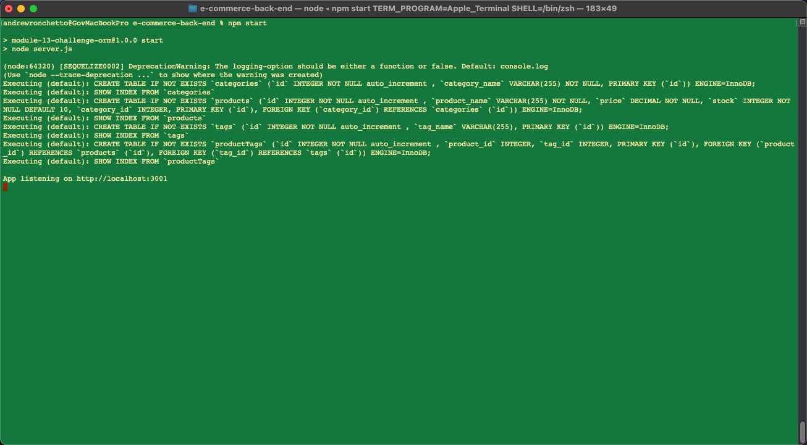
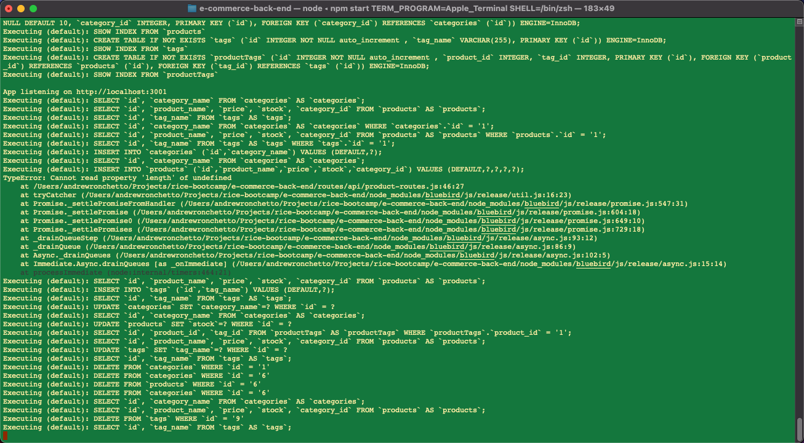
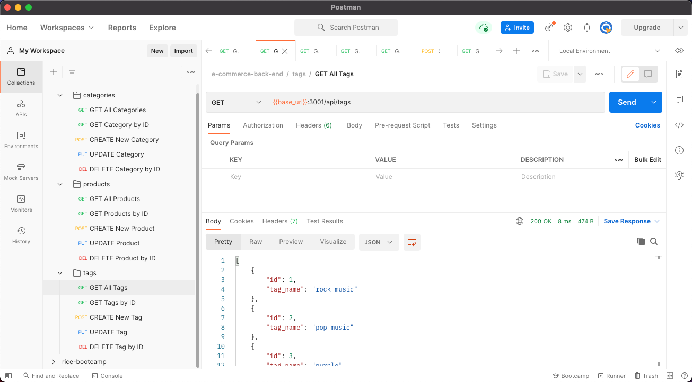

# e-commerce-back-end

## Table of Contents

1. [Description](#description)
1. [Usage](#usage)
1. [User Story](#user-story)
1. [Acceptance Criteria](#acceptance-criteria)
1. [Licenses](#licenses)
1. [Technology](#technology)
1. [Mock-up](#mock-up)
1. [Support](#support)
   - [Installation](#installation)
   - [Questions](#questions)

## Description
The back end suite of services to support businesses of all sizes.

## Usage
You can access the app here: [https://github.com/avidrunner87/e-commerce-back-end](https://github.com/avidrunner87/e-commerce-back-end).

## User Story
>**AS A(N)** manager at an internet retail company<br>
I **WANT** a back end for my e-commerce website that uses the latest technologies<br>
**SO THAT** my company can compete with other e-commerce companies


## Acceptance Criteria
**GIVEN** a functional Express.js API

>**WHEN** I add my database name, MySQL username, and MySQL password to an environment variable file<br>
**THEN** I am able to connect to a database using Sequelize

>**WHEN** I enter schema and seed commands<br>
**THEN** a development database is created and is seeded with test data

>**WHEN** I enter the command to invoke the application<br>
**THEN** my server is started and the Sequelize models are synced to the MySQL database

>**WHEN** I open API GET routes in Insomnia Core for categories, products, or tags<br>
**THEN** the data for each of these routes is displayed in a formatted JSON

>**WHEN** I test API POST, PUT, and DELETE routes in Insomnia Core<br>
**THEN** I am able to successfully create, update, and delete data in my database
## Licenses
[](https://github.com/avidrunner87/e-commerce-back-end/blob/main/LICENSE.md)

## Technology


## Mock-up
The following picture shows the website appearance and capabilities:

<br>

<br>


We also have a video that walks you through the entire application:

[Access Video](https://github.com/avidrunner87/e-commerce-back-end/blob/main/assets/images/screenshots/walkthrough.mp4)
## Support
### Installation
To fork this code to further improve the website, please follow these directions:

1. In Github fork the repository.
1. Clone the repository to your local computer.

      _This assumes that you have setup your own SSH keys to connect with Github._

3. Before running the employee tracker app, please ensure all the necessary node modules are installed:

      ```
      npm install
      ```

4. You will also need to setup your initial database for the application.

   - Log into your local mysql instance

   - Source the schema.sql file located in the db folder

5. Copy and update contents of the .env.example file to reflect your local computer

      ```
      cp .env.example .env
      ```

You can run the application using the following command:
      
```
npm start
```

### Questions
If you have any questions please reach out to me via [Github](https://github.com/avidrunner87) or via [email](mailto:andrew.ronchetto@me.com).